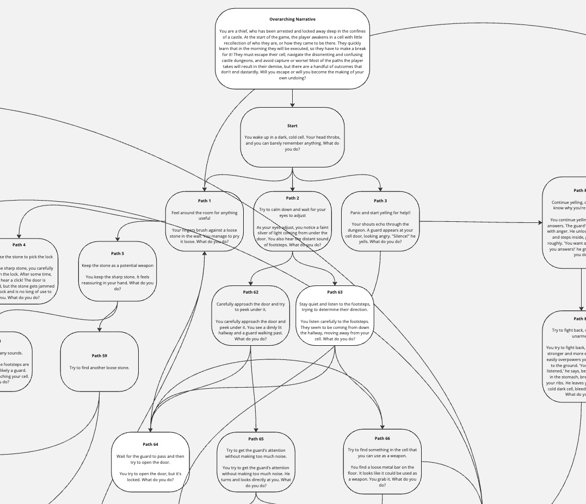

# Dungeon Crawler

   

## Description

  Dungeon Crawler is a turn-by-turn story-based game where the player attempts to free themselves from a prison and find freedom. This application is built on the MERN stack and utilizes GraphQL to interact with MongoDB.
  
## Table of Contents

* [Description](#description)
* [Dependencies](#dependencies)
* [Installation](#installation)
* [Sources](#sources)
* [Usage](#usage)
* [Contributing](#contributing)
* [License](#license)
* [Questions](#questions)

## Dependencies

  This project relies on the following dependencies:

* **Vite**: For faster React application development
* **React**: To create the components, logic, and structure of the application
* **React Icons**: To add icons to the application
* **React Router**: To handle routing within the application
* **Chakra UI**: To style the application and more quickly deploy React components
* **ESLint**: To quickly identify errors during development
* **GraphQL**: To design and implement APIs
* **JWT**: To securely transmit data
* **Bcrypt**: To hash passwords
* **Express**: For middleware between Client and Server
* **Dotenv**: To load environment variables

## Installation

**Prerequisites:**

* Node.js, npm (or yarn) and MongoDB installed.

**Steps:**

1. Clone this repository
2. `cd` into the project folder
3. Install the dependencies by runnning `npm install`
4. Build the environment `npm run build`
5. Seed the database: `npm run seed`
6. `npm run start:dev` to test the application locally. It should open in your browser automatically, but you can adjust the port in the `vite.config.js` file
7. `npm run start` to test the production environment locally

## Sources

The following are images that were utilized by artists throughout the creation of this project:

* [dungeon_entrance image](<https://www.reddit.com/r/PixelArt/comments/b4f0z2/classic_dungeon_entrance/>)
* [waterfall image](<https://www.newgrounds.com/art/view/glhuun/pixel-waterfall>)

## Usage

The game is deployed here: <https://dungeon-crawler-gl7l.onrender.com/>

A good deal of time was spent building out the decision tree for this project:  This determines the actions a user can take throughout the game. It wasn't until I was nearly done with the decision tree that my instructor pointed out to me that I had inadvertantly created a linked list, without knowing what that was prior to starting. A more in-depth view of this decision tree is available [here](<https://miro.com/app/board/uXjVIPmG7Rs=/?share_link_id=182464117585>).

### Core Functionality

* A homepage to share basic information about the game
* A sign up page where you can create an account
* A login page where you can authenticate your access
* A game page that powers the application
* Users make choices, have an inventory, have stats, and a win/loss record

## Contributing

I am not accepting direct contributions at this time for this repository, but you are welcome to fork the repo and utilize this code as the basis for your own game.

## License

  This project is licensed under MIT. For more information, see (<https://opensource.org/licenses/MIT>)

## Questions

  **GitHub**: [coder-guy-pete](https://github.com/coder-guy-pete)

  For any questions, please contact me at: <hintze.peter@gmail.com>
